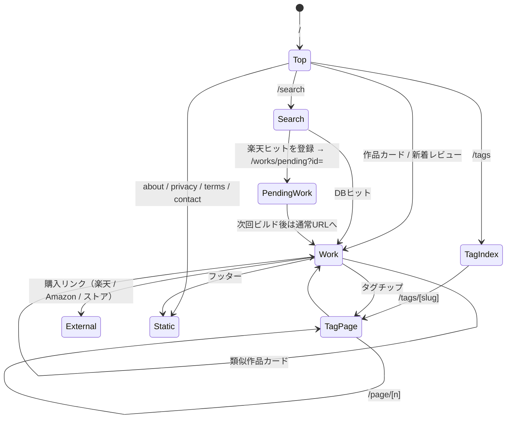
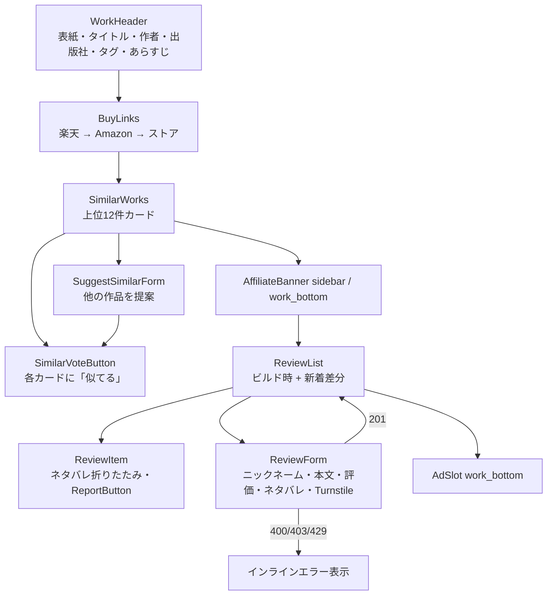
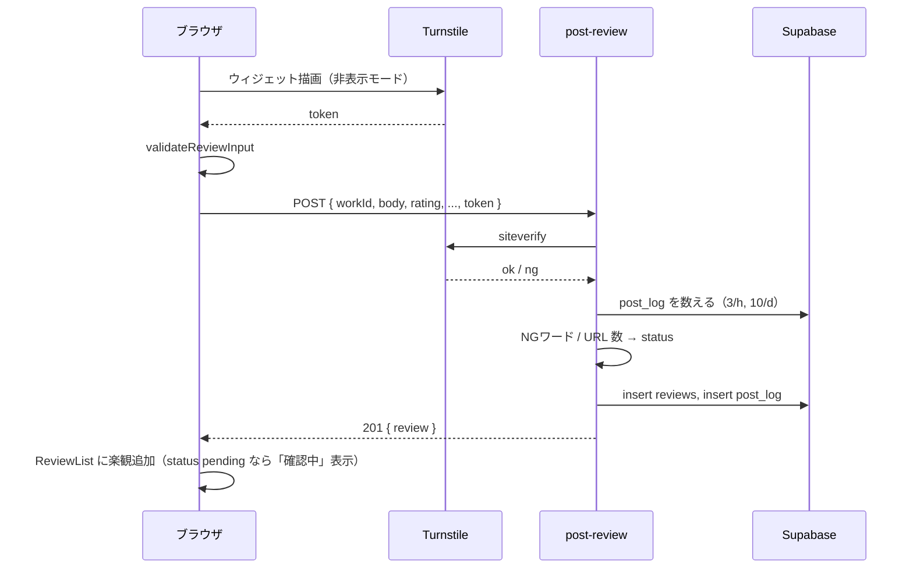

# comicomi ページ・UI遷移図

## 1. ページ遷移



## 2. 作品ページ内 UI



## 3. 検索ページ内 UI

```mermaid
flowchart TD
    SB[SearchBox<br/>デバウンス400ms] --> API[search-works]
    API --> DBR[DBヒット一覧<br/>WorkCard → /works/slug]
    API --> RKR[楽天ヒット一覧<br/>RakutenCandidate + 「この作品を登録」]
    RKR -->|register-work 201| PW[/works/pending?id=]
    RKR -->|429| ERR[しばらく待ってください]
```

## 4. レビュー投稿フロー（クライアント ↔ Edge Function）



## 5. 常時表示要素

| 要素 | 内容 |
|---|---|
| SiteHeader | ロゴ（トップへ）、検索アイコン（/search）、タグ（/tags） |
| SiteFooter | about / privacy / terms / contact、アフィリエイト開示文、© |
| AdSlot sidebar | デスクトップ幅のみ。モバイルは非表示 |

## 6. 画面ごとの静的 / クライアント区分

| ページ | 静的部分 | クライアント部分 |
|---|---|---|
| トップ | 全て | なし |
| 作品 | ヘッダ・購入・類似・ビルド時レビュー | 投票ボタン・新着レビュー差分・投稿フォーム・通報・AdSlot |
| 仮作品（pending） | 枠のみ | 全て（anon key で `works` を id 取得。`status = pending` は RLS で見えないため **pending 用の `works_pending_public` view（id, title, authors, cover_url のみ）を anon に select 許可**する） |
| タグ | 全て | AdSlot |
| 検索 | 枠のみ | 全て |
| 固定 | 全て | なし |

> データ設計書への追記: `works_pending_public` view を追加すること（本書で発生した要件）。

## 7. レスポンシブ方針

- モバイルファースト。作品ページは 1 カラム、`md` 以上で本文 + サイドバー（280px）
- 類似カードはモバイル横スクロール、デスクトップ 4 列グリッド
- 表紙画像は `next/image` を使わず ``（静的書き出し + 外部 CDN のため）

## ローカルデモ

検索欄を空にすると全サンプル候補を表示。登録済み作品→通常作品ページ、未登録候補の登録→`/works/pending/?id=`。追加作品の再検索も仮作品ページへ。上部にデモ表示と初期化ボタンを配置。購入ボタンは外部遷移しない。

## 2026-09-05 視覚ブラッシュアップ

白基調・朱赤アクセント・既存機能と導線を維持。見出し/余白/罫線を整理し、検索欄と操作ボタンを拡大。表紙なしはBookCover共通部品でタイトル入りの仮装丁を表示（デモ表紙/表紙準備中を明記、実在表紙を生成しない）。カードごとの淡色、キーボードフォーカス、低減モーション、モバイル2列を適用。

## 2026-09-05 再調整（利用者確認済み）

紹介ページ風の装飾を撤去。トップは小見出し・GET検索フォーム・作品一覧・新着レビューの順。作品カードは小さな表紙＋作品名/作者/件数の横配置（モバイル1列、広い画面2列）。仮装丁、英語コピー、縦書き、色違い装飾、浮き上がる影を撤去。未取得表紙は中立な「表紙なし」枠。機能は既存検索/投稿/投票を維持。
